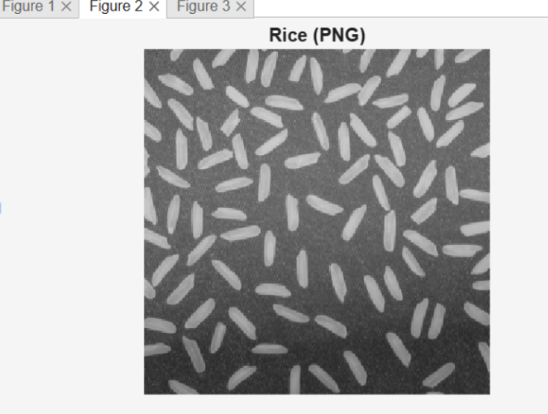
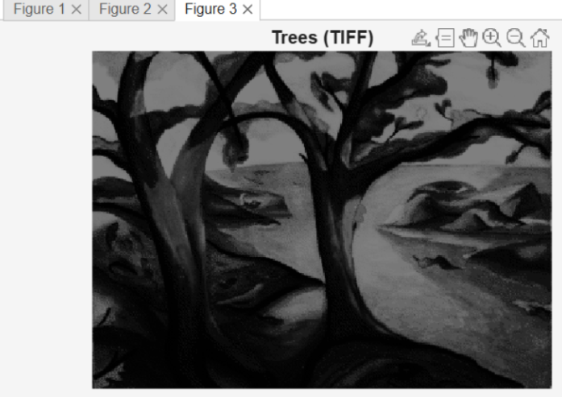
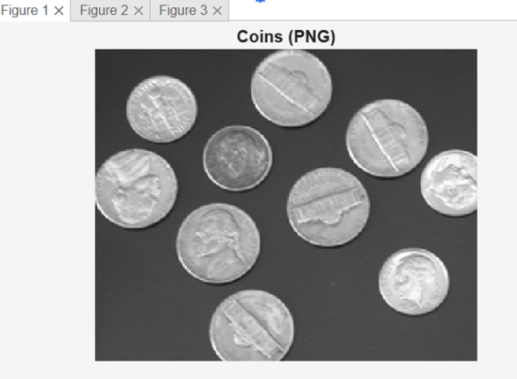
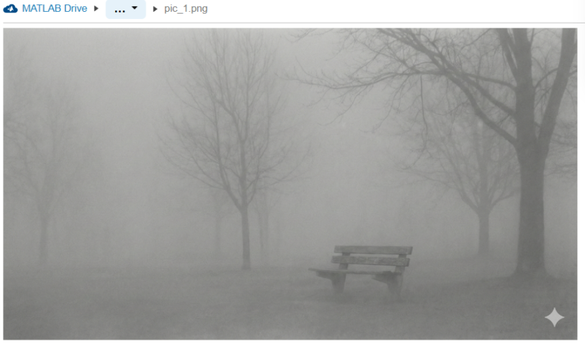
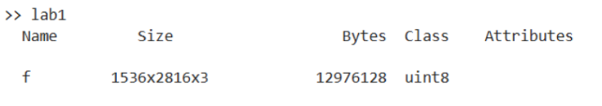
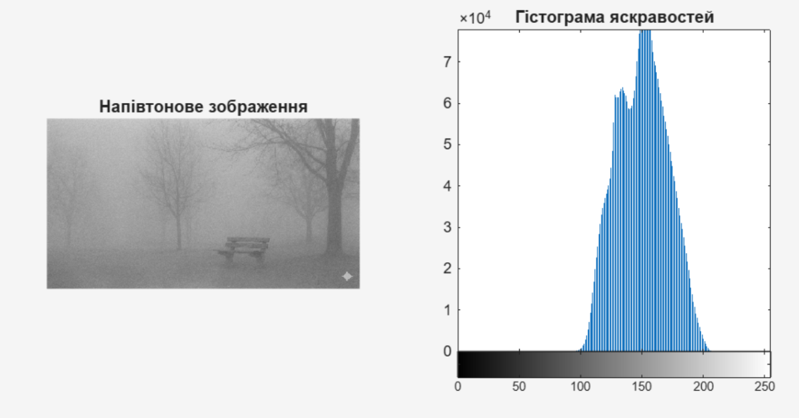
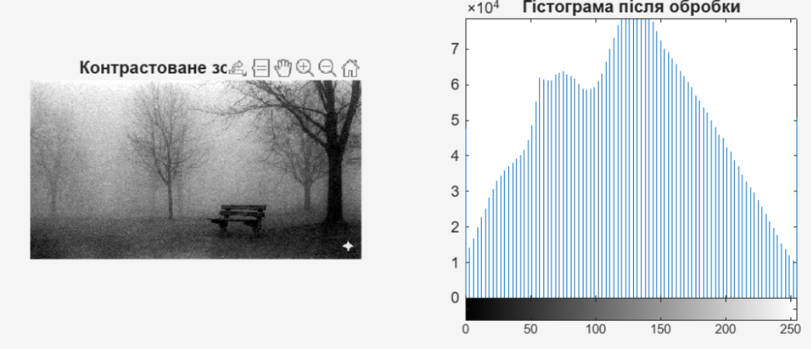
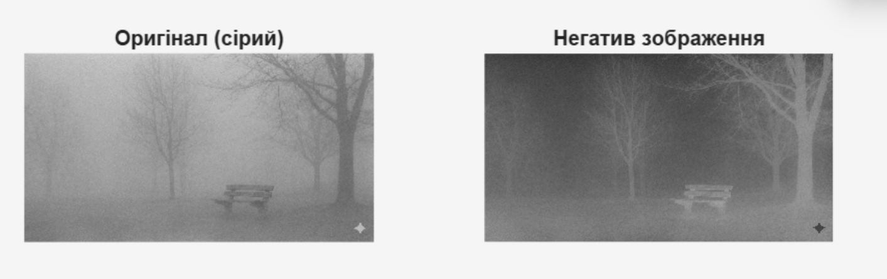
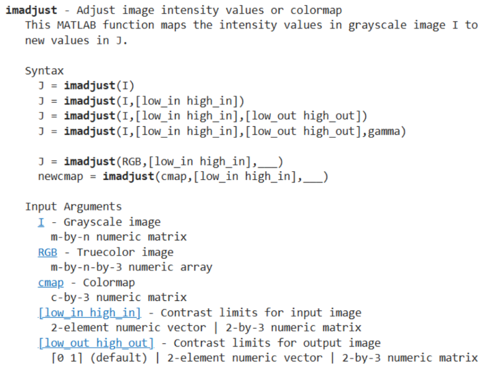

<div align="center">

# Лабораторна робота №1
### на тему: "Аналіз і обробка зображень із MATLAB Image Processing Toolbox"

</div>

---

### Мета
Метою даної лабораторної роботи є утворення основних навичок роботи із зображеннями в додатку Image Processing Toolbox середовища MATLAB.

### Хід роботи

Завантажуємо з бібліотеки MATLAB кілька зображень у різних форматах і відображуємо їх на екрані.
Імпорт вбудованих графічних файлів у робочий простір MATLAB реалізуємо за допомогою функції `imread`. Візуалізація отриманих масивів даних здійснюється через `imshow`, а для автономного відображення кожного об’єкта в окремому графічному вікні застосовуємо команду `figure`.

```matlab
% Зчитування вбудованих зображень різних форматів
I1 = imread('coins.png'); 
I2 = imread('rice.png');  
I3 = imread('trees.tif');

% Відображення
imshow(I1); title('Coins (PNG)'); 
figure, imshow(I2); title('Rice (PNG)');
figure, imshow(I3); title('Trees (TIFF)');
```





Завантажуємо власне зображення з каталогу для аналізу.
Для зчитування графічного файлу з підпапки pictures використовуємо функцію `imread` із вказанням відносного шляху до об’єкта. З метою визначення роздільної здатності зображення та аналізу розмірності відповідної матриці пікселів, використовуємо функцію `size`. Для перевірки технічних характеристик масиву, зокрема встановлення класу даних uint8 та обсягу займаної пам'яті, застосуємо команду `whos`. Для експорту та фіксації копії зображення у каталозі `results` використовуємо функцію `imwrite`.


```matlab
% Завантаження зображення з каталогу
f = imread('pictures/pic_1.png');

% Отримання інформації про зображення
img_size = size(f);
whos f;           

% Збереження зображення у заданий каталог
imwrite(f, 'results/new_pic_1.png');
```




Тепер застосуємо функцію `rgb2gray` для перетворення повноколірного зображення у напівтоновий формат використовуємо. З метою аналізу статистичного розподілу інтенсивності пікселів та його візуалізації у формі стовпчастої діаграми використовуємо функцію `imhist`. 
На гістограмі можемо спостерігати значну концентрацію пікселів у вузькому діапазоні інтенсивностей (приблизно від 100 до 200 одиниць) . Візуально це проявляється як туманний ефект і відсутність глибокого чорного або чистого білого кольорів. Можемо прийти до висновку, що такий розподіл є підтвердженням низької контрастності вхідного файлу.

```matlab
% Перетворюємо кольорове зображення в напівтонове для аналізу яскравості
f_gray = rgb2gray(f); 

% Виводимо зображення та гістограму
figure;
subplot(1,2,1); imshow(f_gray); title('Напівтонове зображення');
subplot(1,2,2); imhist(f_gray); title('Гістограма яскравостей');
```



Тепер перейдемо до функції `imadjust`, для адаптації динамічного діапазону зображення до можливостей засобів візуалізації. Алгоритм забезпечує відсікання екстремальних значень яскравості (по 1% на краях інтенсивності) та лінійне розтягування інформативного інтервалу на повний діапазон квантування [0, 255]. Контроль ефективності перетворення здійснюємо шляхом повторної побудови гістограми за допомогою функції `imhist`. На результуючому графіку можемо спостерігати рівномірний розподіл інтенсивностей вздовж усієї осі, зображення стало значно чіткішим, деталі лавки та дерев на фоні туману стали краще помітними.

```matlab
% Виконуємо контрастування напівтонового зображення
f_adj = imadjust(f_gray);

% Виводимо результат та нову гістограму
figure;
subplot(1,2,1); imshow(f_adj); title('Контрастоване зображення');
subplot(1,2,2); imhist(f_adj); title('Гістограма після обробки');
```



Для інвертування значень яскравості напівтонового зображення застосовуємо функцію `imadjust`. Шляхом встановлення вхідного діапазону як [0, 1] та вихідного як [1, 0] реалізується перетворення рівнів інтенсивності на протилежні, щоб отримати негативне представлення вихідного масиву пікселів. Темні ділянки стали світлими, а світлі - темними.


```matlab
% Отримання негатива
% Параметри [0,1] та [1,0] міняють місцями мінімальну та максимальну яскравість
f_neg = imadjust(f_gray, [0, 1], [1, 0]);

% Відображення результату
figure;
subplot(1,2,1); imshow(f_gray); title('Оригінал (сірий)');
subplot(1,2,2); imshow(f_neg); title('Негатив зображення');
```



Для вивчення повного переліку можливостей функції корекції інтенсивності використовуємо функцію `help`. Іmadjust може приймати додаткові параметри, такі як `gamma` (для гамма-корекції), що дозволяє виконувати нелінійне перетворення яскравості зображення. Використання вбудованої документації є необхідним для точного налаштування алгоритмів інтелектуальної обробки сигналів.

```matlab
% Виклик довідки
% Отримання стислої довідки в командному вікні
help imadjust

% Отримання розширеної документації в окремому вікні
doc imadjust
```



### Висновок
Під час виконання лабораторної роботи я ознайомилася з основами цифрової обробки зображень у середовищі MATLAB Online. Мені вдалося реалізувати повний цикл роботи з графічними даними, від імпорту до програмної корекції характеристик.
Опановано механізм завантаження та зчитування зображень у хмарному сховищі. 
За допомогою функцій `size` та `whos` я навчилася визначати розмірність матриць пікселів, тип даних та обсяг пам’яті, який займає зображення.
Практично перевірено зв’язок між візуальною якістю фото та його гістограмою. Використання функції `imhist` дозволило об’єктивно оцінити динамічний діапазон яскравостей.
Опановано інструмент `imadjust`, який дозволяє ефективно підвищувати контрастність зображень, виконувати гамма-корекцію та отримувати негатив шляхом інверсії значень.
Отримані навички є базою для подальшого вивчення складніших алгоритмів комп'ютерного зору та цифрової обробки сигналів.

### Контрольні питання
* Що таке «гістограма розподілу яскравостей»?
Це статистична діаграма, яка показує, як часто кожен рівень інтенсивності (від 0 до 255) зустрічається на зображенні. По горизонтальній осі відкладаються значення яскравості, а по вертикальній кількість пікселів із цією яскравістю .Що таке «контрастність зображення»?
Це візуальний показник різниці між найтемнішими та найсвітлішими ділянками зображення. Якщо більшість пікселів зосереджена у вузькому діапазоні інтенсивностей , зображення вважається низькоконтрастним.

* Як при контрастуванні змінюється гістограма розподілу яскравостей?
Під час контрастування відбувається лінійне розтягування гістограми. Інформативний інтервал, який раніше був вузьким, розподіляється по всій доступній осі яскравостей. Це дозволяє задіяти весь динамічний діапазон від глибокого чорного до чистого білого кольору.

* Як за необхідності зменшити контрастність зображення?
Щоб зменшити контрастність, потрібно виконати зворотну дію - стиснути діапазон яскравостей. У MATLAB це реалізується через функцію imadjust, де у вихідних параметрах `[low_out, high_out]` вказується вужчий діапазон. Темні зони стають світлішими, а світлі - тьмянішими.

* Як одержати негативне зображення?
Для отримання негатива потрібно інвертувати значення яскравості пікселів: чорне стає білим , а біле - чорним. У MATLAB найпростіше це зробити через imadjust, вказавши вхідний діапазон як [0, 1], а вихідний як [1, 0]. Це дзеркально перевертає рівні інтенсивності.
