<div align="center">

# Лабораторна робота №2

### на тему: "Фільтрація й придушення шумів"

</div>

---

### Мета

Метою даної лабораторної роботи є дослідження ефективності існуючих методів фільтрації зображень, що були спотворені шумами різних типів.

### Хід роботи

Завантажуємо з бібліотеки MATLAB кілька тестових зображень у різних форматах. Імпорт вбудованих графічних файлів у робочий простір MATLAB реалізуємо за допомогою функції `imread`. Для подальшої роботи обрано зображення `eight.tif`, `cameraman.tif` та `coins.png`.

```matlab
% Зчитуємо стандартні зображення з бібліотеки MATLAB
I1 = imread('eight.tif');
I2 = imread('cameraman.tif');
I3 = imread('coins.png');
```

Візуалізація отриманих масивів даних здійснюється через функцію `imshow`. Для автономного відображення кожного об’єкта в окремому графічному вікні застосовуємо команду `figure`. Завдяки цьому проводимо первинний візуальний аналіз структури та якості вихідних зображень перед початком їх обробки.

```matlab
% Відображення завантажених зображень
figure, imshow(I1); title('Зображення 1');
figure, imshow(I2); title('Зображення 2');
figure, imshow(I3); title('Зображення 3');
```

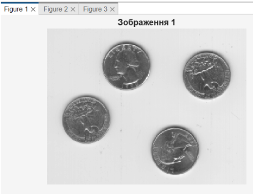

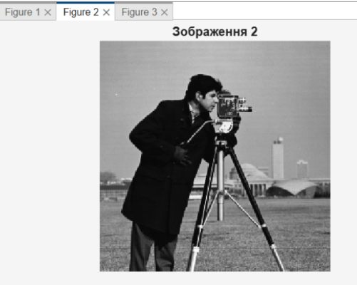


Здійснюємо процедуру зашумлення вихідних зображень для моделювання типових спотворень, що виникають у каналах зв’язку. За допомогою функції `imnoise` додаємо до об’єктів нормальний гаусівський білий шум та імпульсну перешкоду типу «сіль і перець» з різними значеннями щільності.

```matlab
% Додавання гаусівського шуму
J1_gauss = imnoise(I1, 'gaussian');

% Додавання імпульсного шуму з щільністю 0,05
J1_salt = imnoise(I1, 'salt & pepper', 0.05);

% Додавання імпульсного шуму з щільністю 0,1
J2_salt = imnoise(I2, 'salt & pepper', 0.1);
```

Візуалізуємо зашумлені зображення для проведення порівняльного аналізу характеру внесених перешкод. Завдяки відображенню отриманих результатів можемо оцінити ступінь візуальної деградації об’єктів при накладанні адитивного гаусівського шуму та дискретних імпульсних викидів.

```matlab
% Відображення результатів зашумлення
figure, imshow(J1_gauss); title('Гаусівський шум (I1)');
figure, imshow(J1_salt); title('Імпульсний шум 0,05 (I1)');
figure, imshow(J2_salt); title('Імпульсний шум 0,1 (I2)');
```

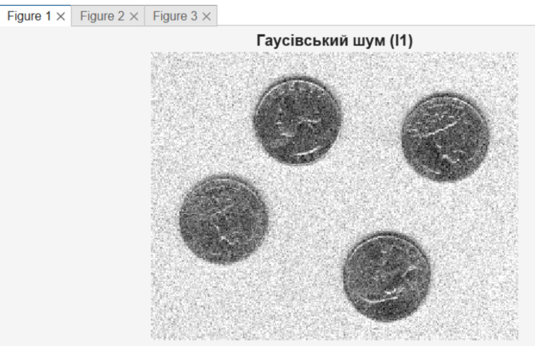

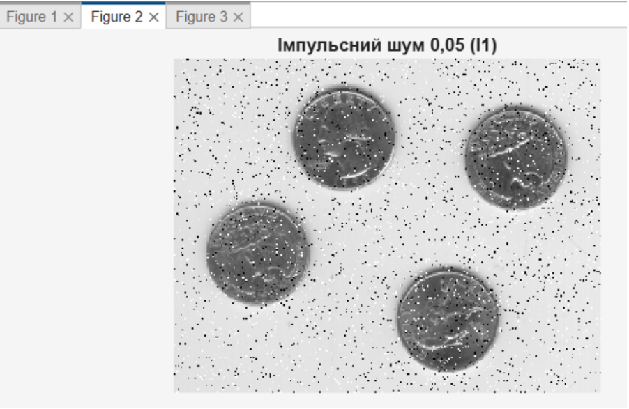

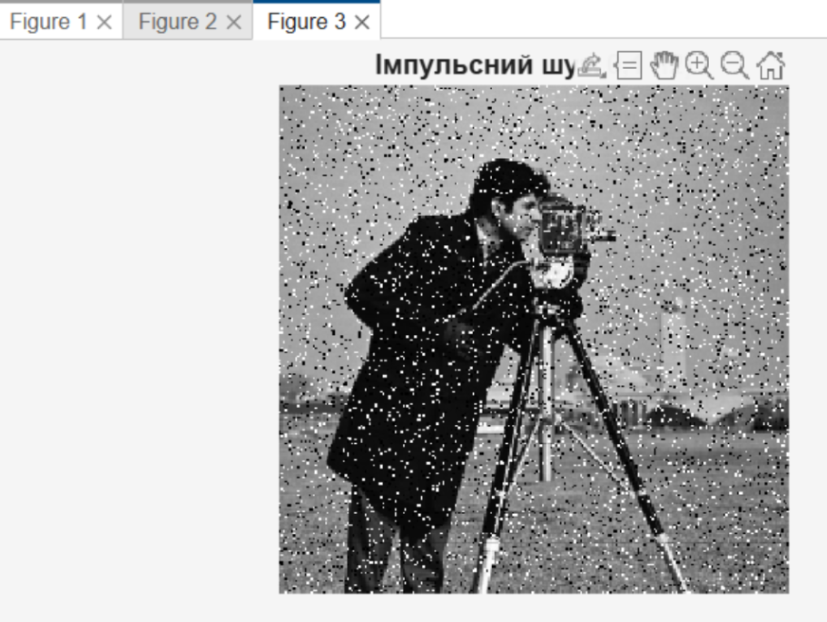

Виконуємо фільтрацію вихідних незашумлених зображень лінійними фільтрами низьких і високих частот. Обробку реалізуємо за допомогою процедури `imfilter`, де параметри масок визначають характер впливу: низькочастотне усереднення для згладжування або високочастотне підкреслення перепадів яскравості для підвищення різкості.

```matlab
% Визначення низькочастотної маски
h_low = ones(3,3) / 9;

% Визначення високочастотної маски
h_high = [0 -1 0; -1 5 -1; 0 -1 0];

% Фільтрація вихідного зображення I1
I1_low = imfilter(I1, h_low);
I1_high = imfilter(I1, h_high);
```

Відображаємо результати обробки на екрані для візуального аналізу змін характеру зображень. Застосування низькочастотного фільтра призводить до розмиття дрібних деталей та згладжування текстур, тоді як високочастотна фільтрація підкреслює контури та дрібні елементи, підвищуючи суб’єктивну різкість об’єкта.

```matlab
% Відображення результату фільтрації
figure, imshow(I1_low); title('Низькочастотна фільтрація (згладжування)');
figure, imshow(I1_high); title('Високочастотна фільтрація (різкість)');
```

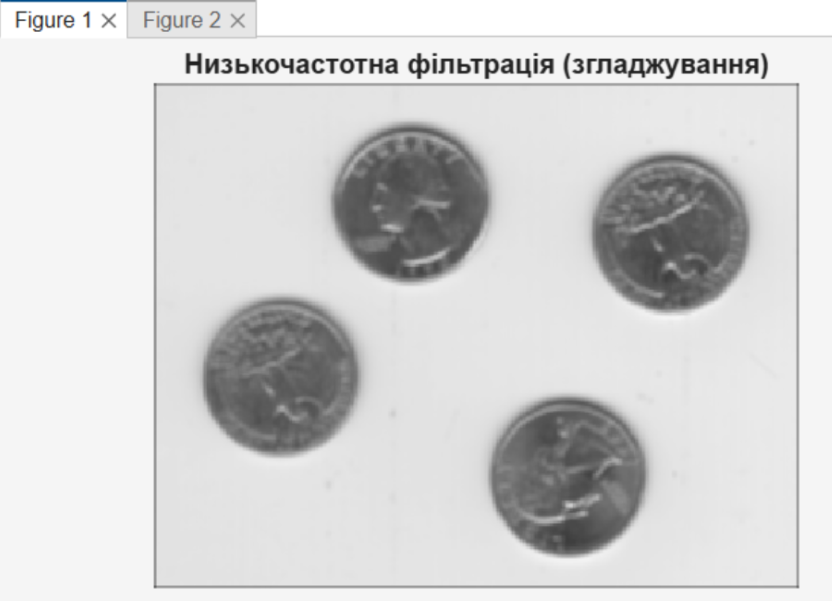

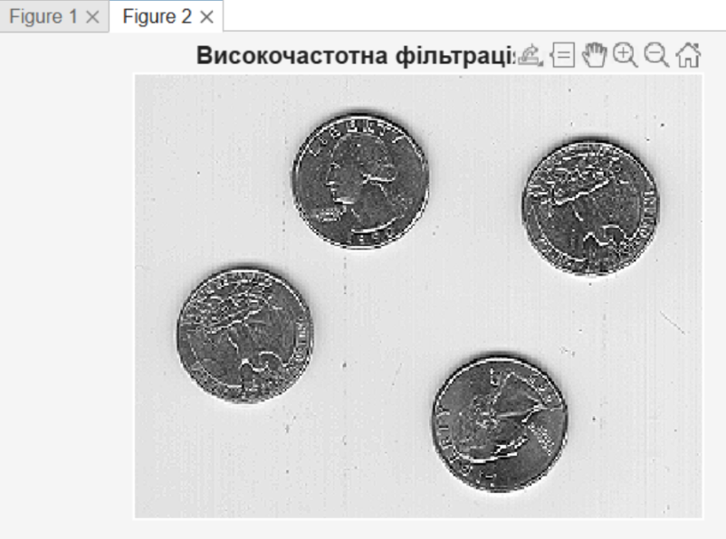

Проводимо обробку зашумлених зображень лінійними фільтрами з різними типами масок. Аналіз результатів показує, що низькочастотні фільтри частково придушують гаусівську перешкоду шляхом усереднення, проте водночас розмивають корисні деталі об’єкта. При роботі з імпульсним шумом лінійна фільтрація виявляється малоефективною, оскільки кожен імпульс перешкоди розмивається в область розміром з вікно фільтра, що погіршує візуальну якість зображення.

```matlab
% Фільтрація гаусівського шуму низькочастотним фільтром
J1_gauss_filtered = imfilter(J1_gauss, h_low);

% Спроба фільтрації імпульсного шуму лінійним фільтром
J1_salt_filtered = imfilter(J1_salt, h_low);

% Відображення результату
figure, imshow(J1_gauss_filtered); title('Лінійна фільтрація (Гаус)');
figure, imshow(J1_salt_filtered); title('Лінійна фільтрація (Імпульсний)');
```

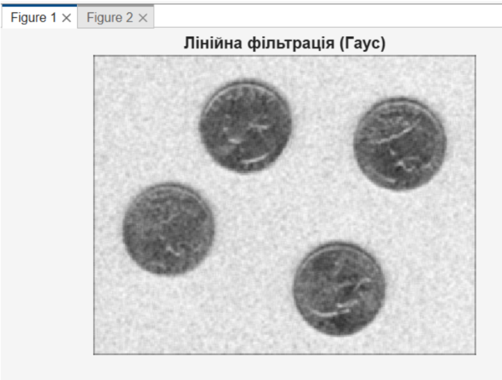

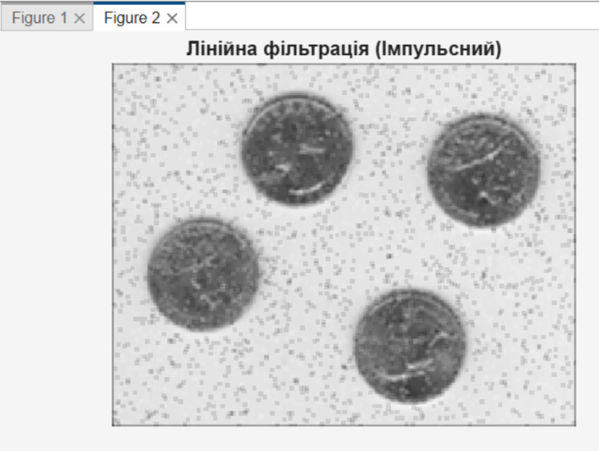

Виконуємо обробку зображень, спотворених гаусівським шумом, за допомогою адаптивного вінерівського фільтра `wiener2`. На відміну від статичних лінійних методів, цей алгоритм адаптує свої характеристики під локальні статистичні параметри кожного фрагмента зображення: середнє значення та дисперсію. Такий підхід ефективніше придушує шум у гомогенних областях і краще зберігає різкість контурів та дрібних деталей.

```matlab
% Адаптивна фільтрація зашумленого зображення
K_gaus = wiener2(J1_gauss, [5 5]);

% Відображення результату
figure, imshow(K_gaus); title('Адаптивна вінерівська фільтрація');
```

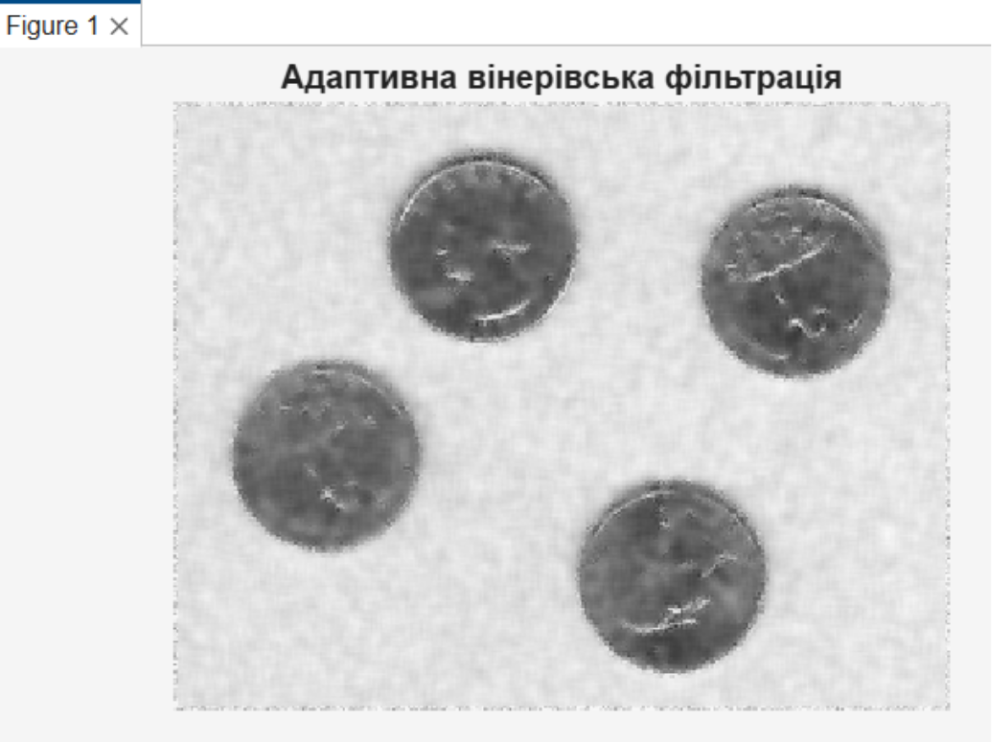

Здійснюємо фільтрацію зашумлених зображень нелінійним медіанним фільтром за допомогою команди `medfilt2`. На відміну від лінійного усереднення, медіанний фільтр замінює значення центрального пікселя медіаною яскравостей усіх точок, що потрапили у вікно апертури. Це ефективно придушує імпульсну перешкоду «сіль і перець», видаляючи аномальні значення пікселів без суттєвого розмиття границь об’єктів. Водночас при обробці зображень із гаусівським шумом медіанна фільтрація демонструє нижчу ефективність порівняно з адаптивними методами.

```matlab
% Медіанна фільтрація імпульсного шуму
K_med_salt = medfilt2(J1_salt);

% Медіанна фільтрація гаусівського шуму для порівняння
K_med_gauss = medfilt2(J1_gauss);

% Відображення результатів
figure, imshow(K_med_salt); title('Медіанна фільтрація (Імпульсний шум)');
figure, imshow(K_med_gauss); title('Медіанна фільтрація (Гаусівський шум)');
```

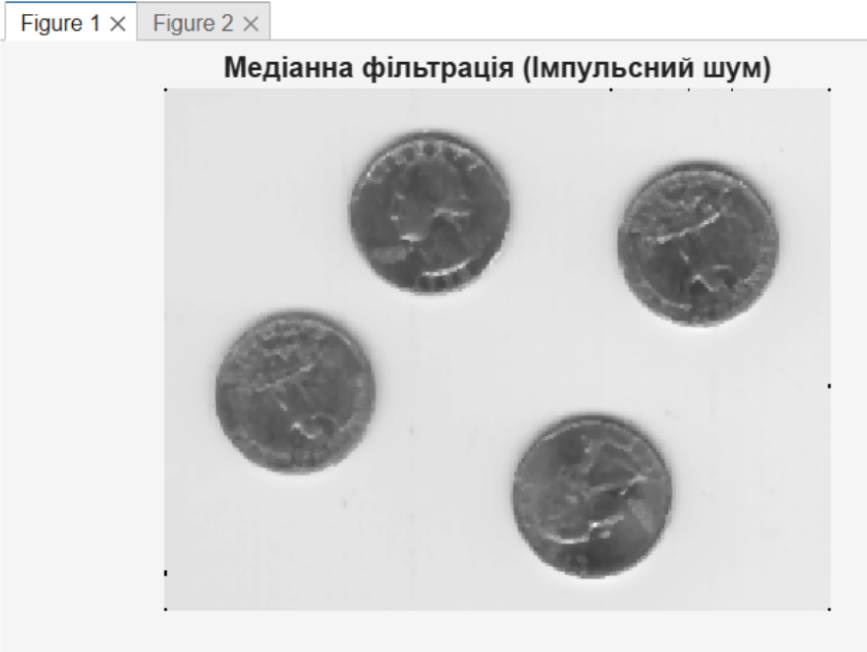

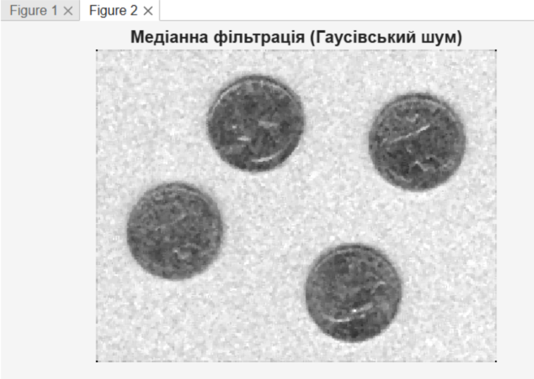

### Висновок

У ході виконання лабораторної роботи було досліджено основні методи фільтрації цифрових зображень та проаналізовано їх ефективність при придушенні шумів різних типів. Практично реалізовано процедури зашумлення зображень гаусівським шумом і шумом типу «сіль і перець», що дало змогу оцінити вплив різних видів перешкод на якість візуальної інформації.

У процесі роботи було застосовано лінійні низькочастотні та високочастотні фільтри, адаптивну вінерівську фільтрацію та нелінійну медіанну фільтрацію. Проведене порівняння результатів показало, що низькочастотна фільтрація ефективно згладжує випадкові коливання яскравості, однак супроводжується втратою дрібних деталей зображення. Високочастотна фільтрація підсилює контури та різкі перепади яскравості, проте одночасно може посилювати вплив шумових складових. Встановлено, що адаптивний вінерівський фільтр забезпечує найкращі результати при обробці зображень, спотворених гаусівським шумом, тоді як медіанний фільтр є найбільш ефективним для усунення імпульсних перешкод типу «сіль і перець».

Отримані результати підтвердили, що вибір методу фільтрації повинен здійснюватися з урахуванням характеру шуму та вимог до збереження деталей зображення. Набуті практичні навички роботи з функціями MATLAB є основою для подальшого вивчення методів цифрової обробки зображень та інтелектуального аналізу сигналів.
