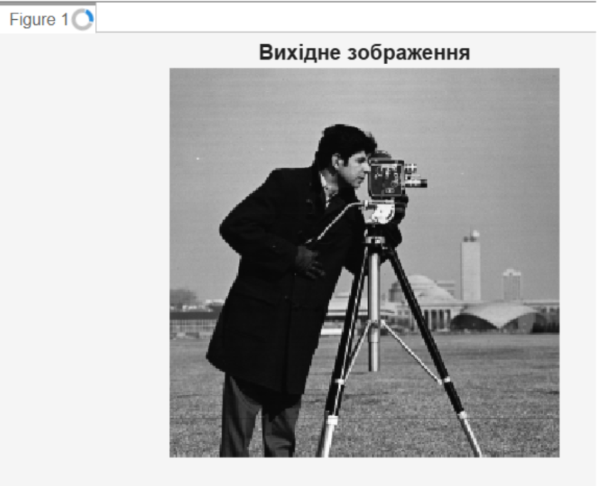
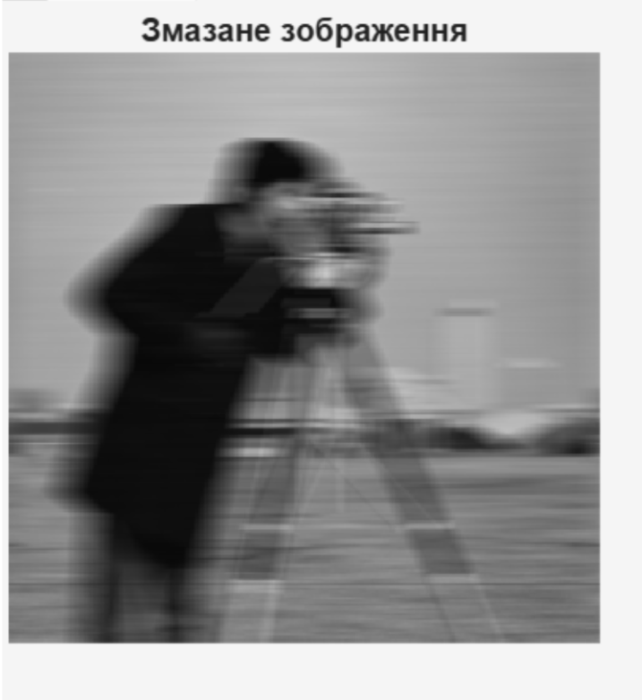
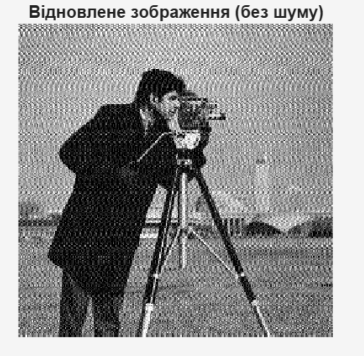
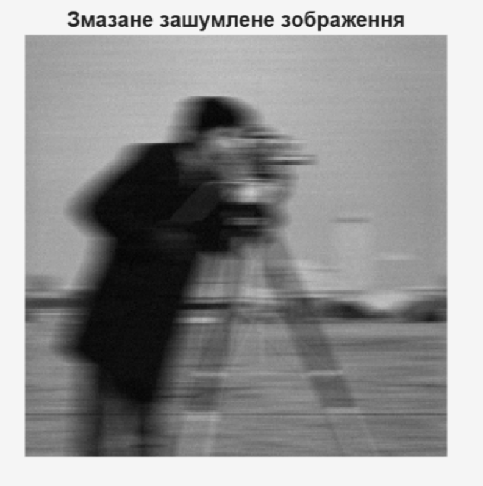
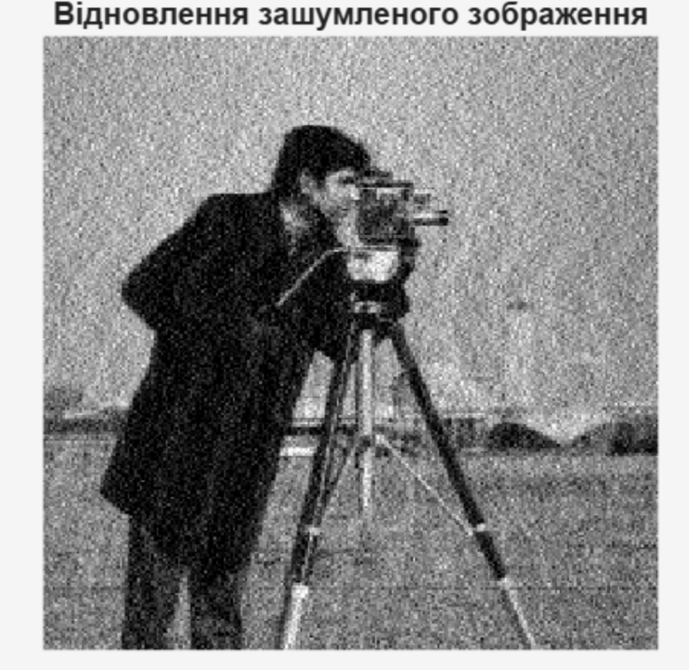

<div align="center">

# Лабораторна робота №3

### на тему: "Відновлення зображень"

</div>

---

### Мета

Метою даної лабораторної роботи є дослідження методів відновлення перекручених зображень як за відсутності шумів, так і з ними.

### Хід роботи

Завантажуємо тестове зображення з бібліотеки MATLAB. Для демонстрації ефектів лінійних перекручень, таких як змазання внаслідок руху, обираємо файл `cameraman.tif`. Зчитування та первинна візуалізація оригіналу здійснюються функціями `imread` та `imshow`.

```matlab
% Зчитування та відображення оригіналу

I = imread('cameraman.tif');

figure, imshow(I);
title('Вихідне зображення');
```

Отримане вихідне зображення використовується як еталон для подальшого дослідження процесів спотворення та відновлення. Наявність чітких контурів і дрібних деталей дозволяє наочно оцінити ефективність застосованих методів деконволюції.



Моделюємо ефект змазання зображення, що виникає внаслідок лінійного руху камери відносно об'єкта під час експозиції. Для цього створюємо спеціальний фільтр motion за допомогою функції `fspecial`, задаючи довжину зсуву LEN та кут руху THETA. Процес спотворення реалізуємо через двовимірну згортку за допомогою `imfilter`.

```matlab
% Змазання: зсув на 21 піксель під кутом 0 градусів

LEN = 21;
THETA = 0;

PSF = fspecial('motion', LEN, THETA);

% Формування змазаного зображення

blurred = imfilter(I, PSF, 'conv', 'circular');

figure, imshow(blurred);
title('Змазане зображення');
```

На отриманому зображенні спостерігається характерне горизонтальне розмиття контурів, спричинене лінійним рухом камери під час формування кадру. Дрібні деталі об’єкта частково втрачаються, а межі між окремими елементами стають менш чіткими, що ускладнює візуальне сприйняття зображення.



Відновлення вихідного зображення за його змазаним спостереженням здійснюється шляхом операції зворотної згортки (деконволюції). Для цього використовуємо функцію `deconvwnr`, яка реалізує фільтр Вінера. Оскільки на даному етапі шум відсутній, параметр відношення сигнал/шум встановлюємо рівним нулю.

```matlab
% Відновлення за відсутності шумів

wnr1 = deconvwnr(blurred, PSF, 0);

figure, imshow(wnr1);
title('Відновлене зображення (без шуму)');
```

Після застосування процедури деконволюції спостерігається часткове відновлення чіткості зображення та покращення видимості контурів об’єктів. Водночас можуть виникати незначні артефакти, пов’язані з особливостями оберненого перетворення та наближеним характером відновлення.



Наступним етапом дослідження є аналіз процесу відновлення зображень за наявності адитивного гаусівського шуму. Додавання шумової складової дозволяє наблизити експеримент до реальних умов функціонування систем формування та передавання зображень.

```matlab
% Додавання шуму до змазаного зображення

noise_mean = 0;
noise_var = 0.0001;

blurred_noisy = imnoise(blurred,'gaussian',noise_mean,noise_var);

% Відновлення з врахуванням SNR

estimated_nsr = noise_var / var(I(:));

wnr2 = deconvwnr(blurred_noisy,PSF,estimated_nsr);

figure, imshow(blurred_noisy);
title('Змазане зашумлене зображення');
```

Додавання шуму до розмитого зображення призводить до додаткового погіршення його якості. Окрім втрати різкості, спричиненої змазуванням, з’являються випадкові коливання яскравості, які маскують дрібні деталі та ускладнюють подальше відновлення.



```matlab
figure, imshow(wnr2);
title('Відновлення зашумленого зображення');
```

Результат вінерівської деконволюції демонструє покращення різкості порівняно із зашумленим змазаним зображенням. Незважаючи на те, що шум не вдається усунути повністю, алгоритм забезпечує компроміс між відновленням деталей та придушенням шумових складових, що позитивно впливає на візуальну якість отриманого результату.



### Висновок

У ході виконання лабораторної роботи було досліджено методи відновлення цифрових зображень, спотворених лінійними перекрученнями та шумами. Практично реалізовано процес моделювання ефекту змазування, що виникає внаслідок руху камери під час формування зображення, а також проаналізовано вплив такого спотворення на візуальну якість і деталізацію об’єктів.

Під час роботи було виконано відновлення перекручених зображень за допомогою вінерівської деконволюції. Отримані результати показали, що за умови відсутності шумів процедура деконволюції забезпечує ефективне відновлення різкості та дозволяє повернути значну частину втраченої інформації. Дослідження також продемонструвало, що наявність навіть незначного рівня адитивного шуму суттєво ускладнює процес відновлення, оскільки шумові складові можуть підсилюватися під час виконання обернених перетворень.

Встановлено, що використання вінерівського фільтра з урахуванням співвідношення між сигналом і шумом дає змогу отримати більш якісний результат порівняно зі звичайною оберненою фільтрацією. Такий підхід забезпечує баланс між підвищенням різкості зображення та обмеженням впливу шумів, що особливо важливо під час обробки реальних даних.

У результаті виконання лабораторної роботи було набуто практичних навичок моделювання спотворень зображень, застосування методів деконволюції та оцінювання ефективності алгоритмів відновлення, що є важливою складовою сучасних систем цифрової обробки зображень і комп’ютерного зору.


### Відповіді на контрольні запитання

1. Поясніть процес формування зображення.

Процес формування цифрового зображення полягає у реєстрації світлового потоку, відбитого або випроміненого об'єктом спостереження, за допомогою оптичної системи та світлочутливого сенсора. Оптична система формує зображення об'єкта на площині приймача, після чого сигнал перетворюється в цифрову форму шляхом дискретизації та квантування. У результаті отримується матриця пікселів, де кожному елементу відповідає певне значення яскравості або кольору.

2. Опишіть модель формування зображень та лінійних перекручень.

У загальному випадку процес формування зображення можна описати моделлю лінійної системи. Спостережуване зображення є результатом згортки вихідного зображення з функцією розсіювання точки (PSF), яка характеризує властивості оптичної системи, а також додавання шуму. Лінійні перекручення виникають через розфокусування, рух камери, атмосферні впливи або недосконалість оптичних елементів. Такі спотворення призводять до втрати різкості, розмиття контурів і зменшення деталізації зображення.

3. Поясніть процес відновлення перекрученого зображення.

Відновлення перекрученого зображення полягає у зворотному перетворенні процесу його спотворення. Для цього використовують методи деконволюції, які на основі відомої або оціненої функції розсіювання точки дозволяють відновити початкову структуру зображення. Одним із найпоширеніших методів є вінерівська деконволюція, яка враховує не лише модель перекручення, а й наявність шумів. У результаті відновлення підвищується різкість зображення, покращується видимість контурів та відновлюється частина втраченої інформації.