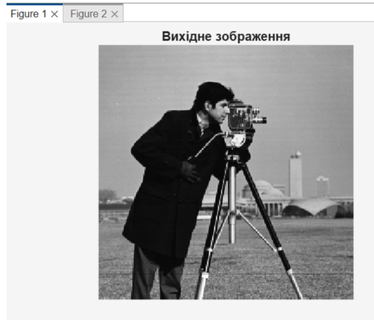
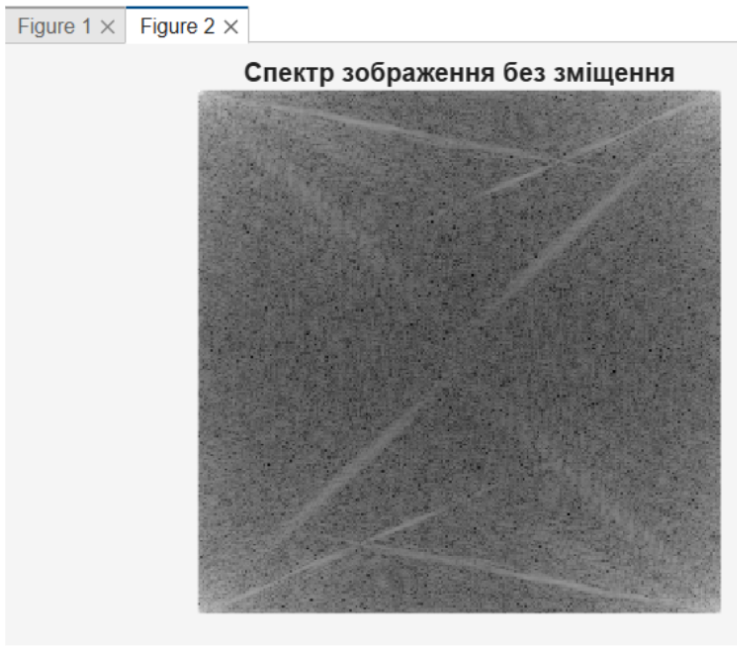
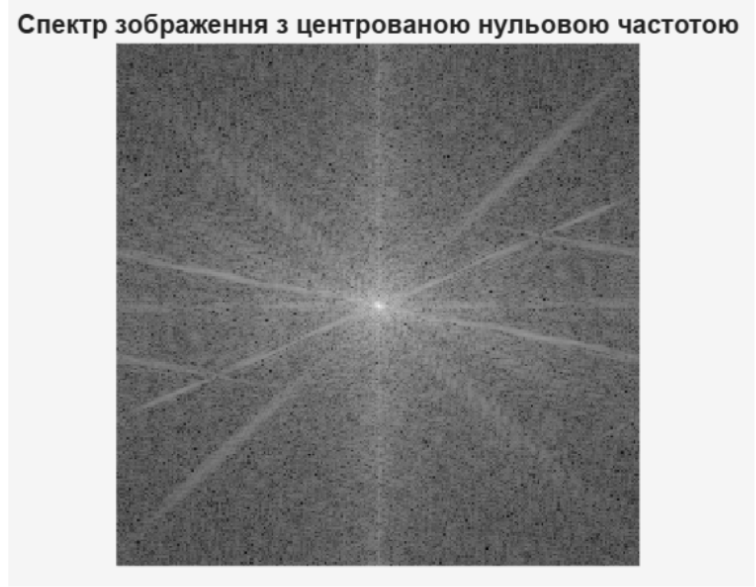
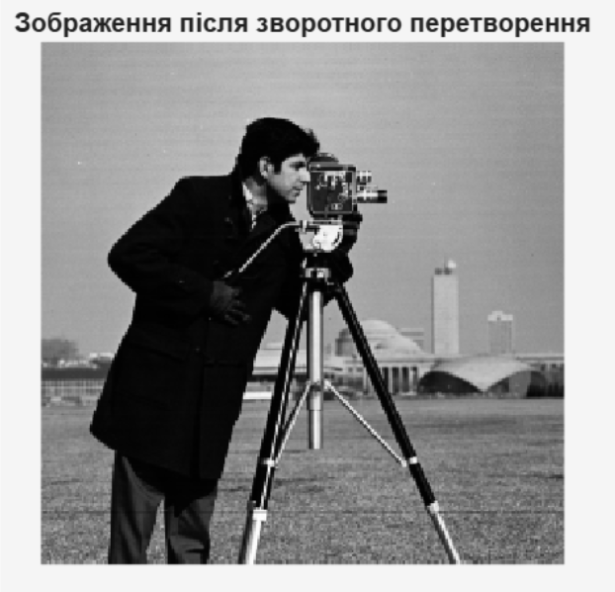
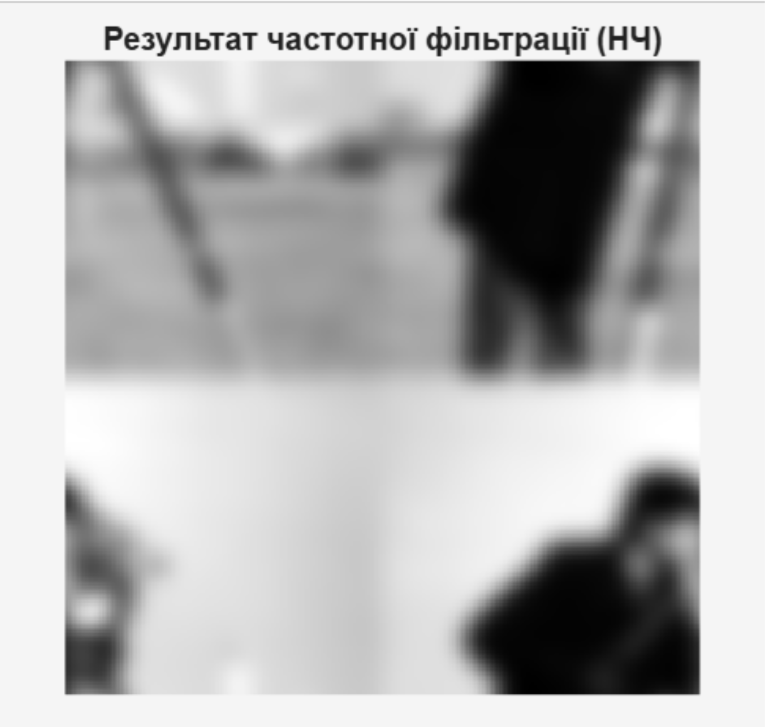

<div align="center">

# Лабораторна робота №4

### на тему: "Просторові перетворення зображень"

</div>

---

### Мета

Метою даної лабораторної роботи є дослідження застосування апарату перетворення Фур'є для аналізу спектрів зображень та виконання фільтрації зображень у частотній області.

### Хід роботи

Виконуємо двовимірне дискретне перетворення Фур'є (ДПФ) для переведення зображення з області просторових змінних у частотну область. Для обчислення спектра в MATLAB застосовуємо алгоритм швидкого перетворення Фур'є через функцію `fft2`. Оскільки спектр має комплексний вигляд, для його візуалізації обчислюємо модуль (амплітудний спектр) за допомогою `abs` та використовуємо логарифмічний масштаб для коректного відображення динамічного діапазону частот.

```matlab
% Зчитування зображення

f = imread('cameraman.tif');

% Обчислення ДПФ та модуля спектра

F = fft2(f);
S = abs(F);

% Логарифмічне перетворення для візуалізації

Slog = log(1 + S);

% Відображення оригіналу та спектра

figure, imshow(f); title('Вихідне зображення');
figure, imshow(Slog, []); title('Спектр зображення без зміщення');
```

Вихідне зображення використовується як тестовий об’єкт для дослідження його спектральних характеристик. Наявність контурів, однорідних областей та дрібних деталей дозволяє наочно проаналізувати особливості розподілу енергії у частотній області.



У спектрі без центрування низькочастотні складові розташовані у верхньому лівому куті частотної площини. Такий спосіб представлення є стандартним результатом роботи функції `fft2`, проте не є зручним для візуального аналізу спектральної структури зображення.

У вихідному ДПФ нульова частота розташована у верхньому лівому куті. Для зручності аналізу використовуємо функцію `fftshift`, яка переносить нульові частоти (центр спектра) в середину частотної області. Це дозволяє наочно побачити розподіл енергії зображення від низьких частот (у центрі) до високих (на периферії).



```matlab
% Центрування спектра

Fc = fftshift(F);
Sc = abs(Fc);
Sclog = log(1 + Sc);

% Відображення центрованого спектра

figure, imshow(Sclog, []);
title('Спектр зображення з центрованою нульовою частотою');
```

Після застосування функції `fftshift` основна енергія спектра концентрується в центрі зображення. Центральна область відповідає низьким частотам, які описують загальну структуру та плавні переходи яскравості, тоді як високочастотні компоненти розташовані ближче до периферії та відповідають за контури і дрібні деталі.



Відновлення зображення із частотної області в просторову реалізуємо за допомогою зворотного двовимірного дискретного перетворення Фур'є (ОДПФ) функцією `ifft2`. Для коректної роботи алгоритму необхідно використовувати спектр із початковим розподілом частот (нульова частота в куті). Якщо використовувався центрований спектр, перед виконанням ОДПФ його необхідно повернути до вихідного вигляду за допомогою команди `ifftshift`.

```matlab
% Повернення спектра до початкового вигляду та ОДПФ

F_back = ifftshift(Fc);
I_restored = ifft2(F_back);

% Відображення результату

figure, imshow(abs(I_restored), []);
title('Зображення після зворотного перетворення');
```

Отримане зображення практично збігається з початковим, що підтверджує коректність виконання прямого та зворотного перетворень Фур'є. Це свідчить про те, що спектральне представлення містить повну інформацію про вихідне зображення.



Згідно з теоремою про згортку, фільтрація в частотній області полягає в поелементному множенні спектра зображення на частотну характеристику фільтра. Такий підхід значно ефективніший за пряму згортку в просторовій області при великих розмірах вікна фільтра. Для реалізації низькочастотної фільтрації формуємо гаусівську передавальну функцію за допомогою `fspecial` та виконуємо ОДПФ від отриманого добутку.

```matlab
% Створення гаусівського фільтра НЧ розміром як зображення

[M, N] = size(f);
sigma = 5;

h = fspecial('gaussian', [M N], sigma);

% Отримання частотної характеристики фільтра

H = fft2(h);

% Фільтрація: множення спектрів

G = F .* H;

% Повернення в просторову область

f_filtered = ifft2(G);

% Відображення результату

figure, imshow(abs(f_filtered), []);
title('Результат частотної фільтрації (НЧ)');
```

Після низькочастотної фільтрації спостерігається згладжування зображення та пригнічення дрібних деталей. Високочастотні складові, що відповідають за різкі перепади яскравості та контури об'єктів, були ослаблені, внаслідок чого зображення набуло більш розмитого вигляду.



### Висновок

У ході виконання лабораторної роботи було досліджено застосування двовимірного дискретного перетворення Фур'є для аналізу та обробки цифрових зображень у частотній області. Практично реалізовано перехід від просторового представлення зображення до його спектральної форми, що дало змогу дослідити розподіл частотних складових та особливості концентрації енергії в спектрі.

У процесі роботи було виконано центрування спектра за допомогою функції `fftshift`, проведено зворотне перетворення Фур'є та підтверджено можливість повного відновлення вихідного зображення зі спектрального представлення. Також досліджено принципи частотної фільтрації шляхом застосування низькочастотного гаусівського фільтра, що забезпечив пригнічення високочастотних складових та згладжування дрібних деталей зображення.

Отримані результати підтвердили ефективність використання частотних методів для аналізу структури зображень та реалізації різних алгоритмів їх обробки. Набуті практичні навички роботи з перетворенням Фур'є є важливою основою для подальшого вивчення методів цифрової обробки сигналів, фільтрації та комп’ютерного зору.
